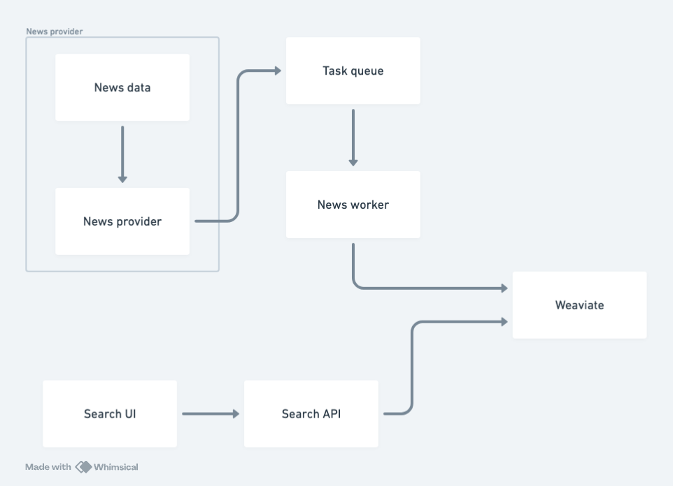

# News search

Search application performing vector similarity search on news articles.

## Start the app

1. Start DB and Localstack
```
docker-compose up -d weaviate localstack
```

2. Setup DB collection and SQS queue
```
cd server
python3 -m venv .venv
source .venv/bin/activate
pip install -r requirements.txt

python database.py
PYTHONPATH=.. python -m news_worker.article_queue
cd ..
```

3. Start rest of the services
```
docker-compose up -d
```
> Keep in mind that restarting `news provider` service would mean that same news dataset is processed again and ultimately would end up in duplicates.

4. Open http://localhost to see the app.
## Architecture



### News provider
`News provider` service reads news data from a CSV file and puts articles into the task queue.

A couple of optimization steps are done in this service to make it more efficient:
- **Articles are sent in batches of 10** (to minimize the latency when conencting to SQS).
- **Batches are processed in 10 simultaneous asyncio coroutines** (so the service is not waiting around doing nothing due to I/O when connecting to SQS).


You check how many messages are in the queue using AWS CLI:
```
aws --endpoint-url=http://127.0.0.1:4566 sqs get-queue-attributes --queue-url=http://sqs.eu-north-1.localhost.localstack.cloud:4566/000000000000/article --attribute-names=All
```

### News worker
`News worker` service reads the articles from the task queue and ingests them to Weaviate.

Here a few of optimization steps are made as well:
- **Read articles from SQS queue in batches of 10.**
- **Insert articles to DB in batches of 10** (to minimize number of connections).
- **SQS messages are processed in 20 simultaneous asyncio coroutines** (most time consuming operation is saving to DB here, so this way worker does not need to wait around during I/O work and can still process other messages in the meantime).

### Search interface
`Seach UI` is a React app displaying news articles with a search bar.

`Search API` used as a FastAPI web server to pass queries to Weaviate database and retrieve related news articles. It mostly acts as a proxy between a browser application and database to encapsulate access to Weaviate and API keys. It adds potential latency, but ensures security.

Search is performed by utilizing news' `title` and `description` vectors. As title information is more important, when querying `title` vector is weighted more than `description`.

## Next steps
In order to operationalize this application, few steps would be needed.

### CI/CD
Use CI/CD tools (e.g. GitHub actions, ArgoCD) to streamline and automate the deployment of each of the services:
- build the Docker images.
- push the images to some repository (e.g. AWS ECR).
- deploy Docker containers into Kubernetes cluster.

### Kubernetes
If Kubernetes were used, some release versioning tool could be useful (e.g. Helm) to manage deployments and rollbacks.

To make application production-ready, we need make sure it scales properly:
- News worker should auto-scale and be load balanced based on number of messages in the task queue.
- Nginx server delivering browser application's resources and search API should auto-scale based on number of requests coming in.

### Browser application
To use it in production, SSL certificates should be setup, so no traffic data could be read by bad actors.

### Terraform
To version cloud infrastructure and use it as code, Terraform could be used.

For this app, we would need to confugure couple of things:
- `Article` queue. Additionally, dead-letter queue should be setup for any unexpected or failing messages, so it doesn't stop the service from working and allows developers to look at failing messages at their own pace.
- `Cohere` API key as secret for embeddings for Cohereʼs embedding API.

### Weaviate
In real life the app would use serverless Weaviate could for scalability instead of dedicated instance.

We should make sure connection pool is being used, because opening new connections can usually be resource consuming.

Also, would be good to have schema versioning, although not sure if any tooling exists yet.